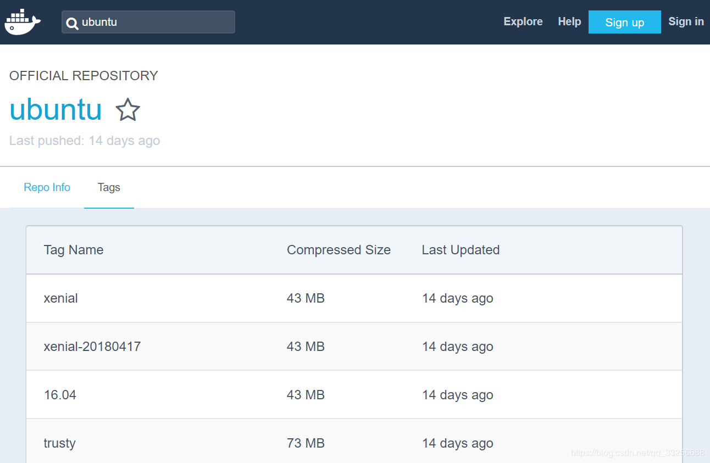
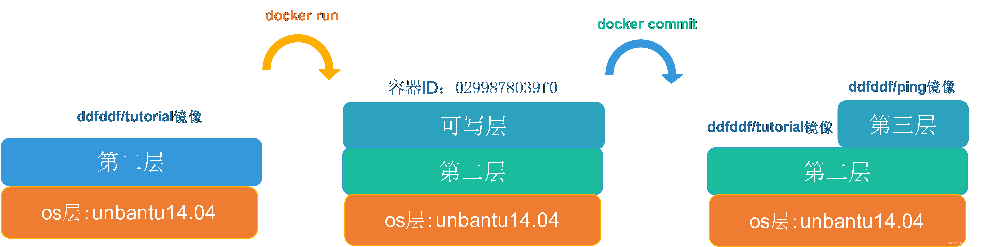
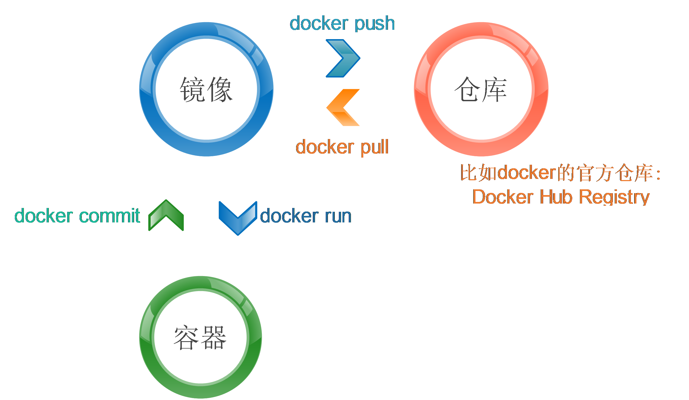

## docker的安装

建议按照docker的官方安装文档一步一步来https://docs.docker.com/install/。

安装好docker后，不要忘了用service docker start或者systemctl start docker（如果是centos7以上版本的话）启动docker的服务

## 配置docker不需要sudo

刚装好的docker每次使用docker命令都需要sudo，比较麻烦，可以通过以下命令省去sudo：

```shell
sudo usermod -aG docker 当前用户名
```

然后一定要记得重新登录该用户才能生效。

## docker核心概念

要理解docker，最核心的是理解三个概念，分别是：仓库（Registry）、镜像（image）和容器（Container）。

### 仓库（Registry）

所谓仓库，其实是个镜像仓库，里面有很多别人已经打包好的镜像，可以直接使用docker pull命令将仓库中的镜像拉到本地，默认的仓库Docker的官方仓库Docker Hub Registry。

因为墙的缘故，官方仓库的速度会比较慢，可以配一个官方的中国加速镜像，方法是：修改 `/etc/docker/daemon.json`，加上如下的键值:

```
{
  "registry-mirrors": ["https://registry.docker-cn.com"]
}
```

之后重启docker服务即可生效。

使用以下命令可以去仓库中搜索含有tutorial关键字的镜像：

```shell
docker search tutorial
```

输出如下：
```
NAME                                          DESCRIPTION                                     STARS               OFFICIAL            AUTOMATED
learn/tutorial                                                                                38                                      
georgeyord/reactjs-tutorial                   This is the backend of the React comment box…   5                                       [OK]
chris24walsh/flask-aws-tutorial               Runs a simple flask webapp demo, with the op…   1                                       [OK]
......(以下省略)
```

可以使用docker pull命令从仓库中拉取刚刚搜索到的镜像到本地，这里为了避免learn/tutorial那个镜像被取消，重建了一个一样的，这里拉取我创建的那个镜像：

```shell
docker pull ddfddf/tutorial
```

输出如下：

```
Using default tag: latest
latest: Pulling from ddfddf/tutorial
271134aeb542: Pull complete 
483756d37259: Pull complete 
Digest: sha256:4615baf428c61a6feafd8f77f91e0cadc7f8f080710cc82362ac89a5f66a329c
Status: Downloaded newer image for ddfddf/tutorial:latest
```

`ddfddf/tutorial`为刚刚搜索到镜像名，默认情况下会拉去最新版本的镜像，即`ddfddf/tutorial:latest`，你也可以用:指定某个特定版本的镜像，比如`docker pull ubuntu:14.04`。其实冒号后面的这个东西的官方术语叫做tag，这个tag可以是一串数字（比如unbantu:14.04的tag是14.04），也可以是一个单词（比如debian:stretch的tag是stretch），latest也只是一个普通的tag而已，只是当`docker pull`不去专门指定tag时，默认会去下载tag为latest的镜像，通过在Docker Hub Registry中搜索你想要的镜像，点进去之后可以查看到有哪些tag可以提供下载，如下图：



### 镜像（Image）

通过`docker images`命令可以看到本地已有的镜像：


```
REPOSITORY                              TAG                 IMAGE ID            CREATED             SIZE
ddfddf/tutorial                         latest              48a0196af3c3        3 hours ago         140MB
```

每个镜像都有一个IMAGE ID作为唯一标识，可以看出这个镜像的IMAGE ID为48a0196af3c3，使用镜像的id可以将它删除，命令如下：

```
docker rmi 镜像id
```

这里先不要着急把刚刚拉下来的镜像删掉，待会实验还要用。

### 容器（Container）
然后使用`docker run`来运行这个镜像（运行之后镜像就变成一个容器）：

```
docker run ddfddf/tutorial apt-get install -y ping
```


这个命令会在docker容器中执行"`apt-get install -y ping`"，也就是安装一个ping命令，运行完之后容器就自动退出了。之后使用docker ps命令可以查看所有当前正在运行的容器，输出如下：

```
CONTAINER ID        IMAGE               COMMAND             CREATED             STATUS              PORTS               NAMES
```

空的，没有任何一个容器正在运行，之所以会这样是因为刚刚容器执行完命令后就退出了。使用`docker ps -a`命令可以查看到所有容器，不管它正在运行还是已经退出，输出如下：

```
CONTAINER ID        IMAGE                COMMAND                  CREATED             STATUS                      PORTS               NAMES
0299878039f0        ddfddf/tutorial       "apt-get install -y …"   1 minutes ago      Exited (0) 11 minutes ago                       peaceful_wozniak
```


每个容器也会有一个ID作为唯一标识，从上面的输出中可以看出CONTAINER ID是0299878039f0.

每个容器也会有一个ID作为唯一标识，从上面的输出中可以看出CONTAINER ID是0299878039f0.

我们尝试一下如下的命令：

```
docker run ddfddf/tutorial ping www.baidu.com
```


这个命令会报如下的错误：

```
docker: Error response from daemon: OCI runtime create failed: container_linux.go:348: starting container process caused "exec: \"ping\": executable file not found in $PATH": unknown.
```


从`"ping": executable file not found in $PATH`这句话中可以看出是因为ping命令没有装导致的，刚刚明明装过ping命令了，为什么没有呢？这是因为在容器中的修改并不会影响镜像，通过`docker commit`命令可以将这个容器提交成一个新的镜像。命令如下：

```
docker commit 0299878039f0 ddfddf/ping
```


命令中0299878039f0是之前用docker ps -a查询出来的容器ID。

试一下我们新提交的镜像learn/ping:

```
docker run ddfddf/ping ping www.baidu.com
```


输出如下：

```
PING www.a.shifen.com (111.13.100.92) 56(84) bytes of data.
64 bytes from promote.cache-dns.local (111.13.100.92): icmp_req=1 ttl=127 time=60.3 ms
64 bytes from promote.cache-dns.local (111.13.100.92): icmp_req=2 ttl=127 time=61.8 ms
......(以下省略)
```

可见ping命令可以使用了。在上面这个现象的背后，容器其实只是在镜像上面添加一个可写层，每当对这个容器进行修改都会在可写层标明与原本镜像的不同之处，当你使用`docker commit`命令时，只是提交了一个可写层，将它变成一个不可写的镜像层，而这个新的镜像和原本的镜像共享原本镜像的所有层，这就是所谓的docker分层机制，其实每个docker镜像都是由好多层构成的，这个机制能极大地缩小镜像占用的硬盘空间，如下图：



刚刚我们运行ping命令的时候都是在前台运行的，在它运行的时候我们命令行做不了别的事情，只能眼睁睁地看它输出，使用如下命令可以让它后台运行：

```
docker run -d ddfddf/ping ping www.baidu.com
```


这个时候在控制台就看不到它的输出，使用`docker ps`可以看到这个容器的id，它是目前唯一正在运行的容器，如果想看它的输出的话可以使用`docker logs` 容器ID的方式查看。

这个时候在控制台就看不到它的输出，使用docker ps可以看到这个容器的id，它是目前唯一正在运行的容器，如果想看它的输出的话可以使用docker logs 容器ID的方式查看。

使用docker stop命令可以停止这个后台运行的容器：

```
docker stop 2f371d67d92d
```


2f371d67d92d为这个容器在我的电脑上的ID

如果你想继续让这个容器运行，可以使用`docker start`命令：

```
docker start 2f371d67d92d
```


这个容器又会从刚才停止的地方重新运行，在初学的时候总是会搞混`docker start`与`docker run`命令，其实在理解了容器与镜像的区别之后，就很容易理解了，`docker run`使用来启动镜像的，而`docker start`是用来重新启动被停止的容器的。
只要镜像被执行了一次啊，都会生成一个新的容器，所以此时用`docker -a`会看到好多废弃的容器，可以使用`docker rm` 容器ID的方式将他们删除掉，也可以使用如下的小技巧一次性删除所有容器：

```
docker rm $(docker ps -a -q)
```


不用担心，这里只是删除所有容器而已，镜像还完好无损的保留在那里。

这里把容器和镜像容易混淆的命令总结在了下表中：

|      | 删除       | 启动         |
| ---- | ---------- | ------------ |
| 镜像 | docker rmi | docker run   |
| 容器 | docker rm  | docker start |

上文中一直使用容器ID来标明容器，其实在启动的时候可以通过–name选项来指定一个别名，之后就可以使用这个别名来代替容器ID使用，注意这个别名必须在本台机器中唯一，示例如下：

```
docker run -d --name=test ddfddf/ping ping www.baidu.com
docker stop test
docker rm test
```


上面的命令中给容器起了一个叫做test的别名，然后使用它的别名将其停止与删除。

上面的命令中给容器起了一个叫做test的别名，然后使用它的别名将其停止与删除。

如果有些情况下不得已要进入容器内部进行操作的话，可以使用如下命令进入容器内部的shell：

```
docker run -d --name=test ddfddf/tutorial ping www.baidu.com
docker exec -ti test /bin/bash
```

`docker exec`用于在正在运行的容器中执行命令，-ti选项表示分配一个虚拟终端。注意docker exec只能在“正在运行”的容器中执行命令，所以在docker run的时候执行ping就是为了让这个容器一直运行，而不是立即退出。

### 再聊聊仓库（Registry）

之前讲过，Docker Hub Registry是Docker的官方仓库，其实这是一个有点类似于Github的地方，任何人都可以在上面提交与下载镜像，我们可以先去上面注册一个账户（地址：https://hub.docker.com/），注册账户时会有谷歌的人机认证系统，所以需要一些科学上网技巧。
注册完成后可以用如下命令在shell中登录：

```
docker login -u 用户名 -p 密码
```


在将镜像push到自己新建的账户之前，要用`docker tag`重命名一下，将镜像命名你的用户名/镜像名这种形式，不然会push认证不通过，代码如下：

```
docker tag ddfddf/tutorial 你的用户名/tutorial 
```

`docker tag`并没有干太多的事情，只是创建了一个到ddfddf/tutorial镜像的引用。之后就可以使用`docker push`命令将自己的镜像推送到账户中去了，方便自己和别人的使用：

```
docker push 你的用户名/tutorial 
```

搞定之后就可以使用以下命令登出了：

```
docker logout
```

登录上Docker Hub，你将能看到刚刚你push上去的镜像。

总结
最后我再总结一下Docker的三个核心概念间的关系：



