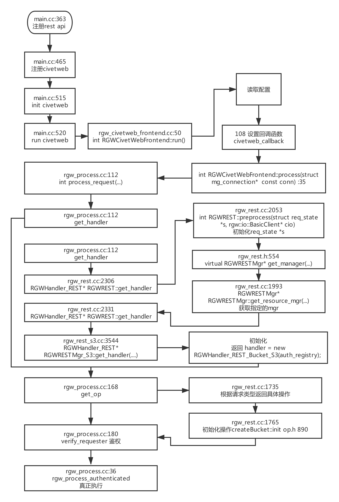

```c++
class RGWCreateBucket : public RGWOp {
protected:
  RGWAccessControlPolicy policy;
  string location_constraint;
  string placement_rule;
  RGWBucketInfo info;
  obj_version ep_objv;
  bool has_cors;
  RGWCORSConfiguration cors_config;
  boost::optional<std::string> swift_ver_location;
  map<string, buffer::list> attrs;
  set<string> rmattr_names;

  bufferlist in_data;

  virtual bool need_metadata_upload() const { return false; }

public:
  RGWCreateBucket() : has_cors(false) {}

  void emplace_attr(std::string&& key, buffer::list&& bl) {
    attrs.emplace(std::move(key), std::move(bl)); /* key and bl are r-value refs */
  }

  int verify_permission() override;
  void pre_exec() override;
  void execute() override;
  void init(RGWRados *store, struct req_state *s, RGWHandler *h) override {
    RGWOp::init(store, s, h);
    policy.set_ctx(s->cct);
  }
  virtual int get_params() { return 0; }
  void send_response() override = 0;
  const string name() override { return "create_bucket"; }
  RGWOpType get_type() override { return RGW_OP_CREATE_BUCKET; }
  uint32_t op_mask() override { return RGW_OP_TYPE_WRITE; }
};

class RGWCreateBucket_ObjStore : public RGWCreateBucket {
public:
  RGWCreateBucket_ObjStore() {}
  ~RGWCreateBucket_ObjStore() override {}
};


class RGWCreateBucket_ObjStore_S3 : public RGWCreateBucket_ObjStore {
public:
  RGWCreateBucket_ObjStore_S3() {}
  ~RGWCreateBucket_ObjStore_S3() override {}

  int get_params() override;
  void send_response() override;
};

```

